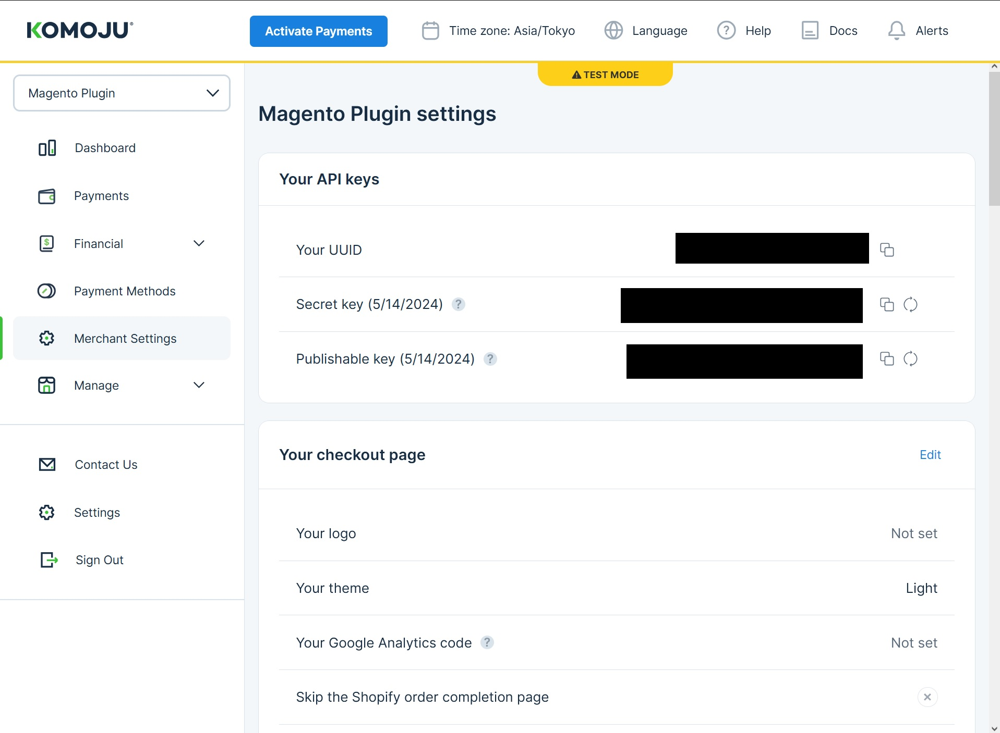
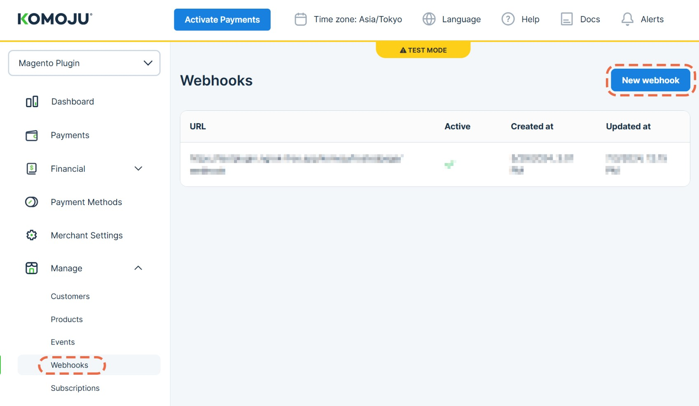

# KOMOJU-Magento Plugin Quick Start Guide

Enhance your Adobe Commerce (Magento) store with KOMOJU, the trusted payment gateway for smooth and secure Japanese payment processing.

## 📌 Prerequisites

- A [Adobe Commerce (Magento) account](https://business.adobe.com/products/magento/magento-commerce.html)
- A [KOMOJU account](https://komoju.com/)

---

## 📌 Installation Instructions

### Installing the Module Manually

1. **Download the latest module** from the [GitHub release page](https://github.com/degica/komoju-magento/releases).

2. **Extract the module files** into your Magento installation directory:

    ```bash
    unzip komoju-magento-release.zip -d $MAGENTO_INSTALL/src/app/code
    ```

    *(Replace `$MAGENTO_INSTALL` with your actual Magento install path.)*

4. **Install the new module** by running:

    ```bash
    php bin/magento setup:upgrade
    php bin/magento setup:di:compile
    php bin/magento cache:flush
    php bin/magento setup:static-content:deploy
    ```

---

## 📌 Configuring the Plugin

After installation, configure the plugin in your Magento admin panel:

1. In your Magento Admin Panel, navigate to:

    **Stores** > **Sales** > **Payment Methods** > **KOMOJU** > **API Settings**  

2. **Enter your KOMOJU account details** as found on your [KOMOJU merchant settings page](https://komoju.com/admin/merchant_settings).



### API Settings
- **Merchant UUID**: Your UUID  
- **Secret Key**: Secret Key  
- **Publishable Key**: Publishable Key  
- **Webhook Secret**: (See *Configuring the KOMOJU Webhook* below)


---

## 📌 Configuring the KOMOJU Webhook

1. **Visit your [KOMOJU dashboard’s Webhook page](https://komoju.com/merchant/webhooks)** and click **"New Webhook"**.

2. **Set the Webhook URL** to:

    ```
    <your-magento-domain>/komoju/hostedpage/webhook
    ```

    *(Replace `<your-magento-domain>` with your store’s actual domain.)*

    For example, if your Magento URL is **https://magento.komoju.com**, then your Webhook URL would be **https://magento.komoju.com/komoju/hostedpage/webhook**.

    

3. **Choose a secret** and enable the following events:

    - `payment.authorized`
    - `payment.captured`
    - `payment.expired`
    - `payment.cancelled`
    - `payment.refunded`
    - `payment.refund.created`

      
    

4. **Save the Webhook**, then copy the **Webhook Secret** provided.

5. **In your Magento admin panel**, navigate to:

    **KOMOJU** > **API Settings** > **Webhook Secret**

    Paste the copied **Webhook Secret**.

## 📌 Contact Us

If you have any questions or concerns, feel free to reach out to our support team at:  
[support@degica.com](mailto:support@degica.com)

---

*Thank you for choosing KOMOJU! We look forward to supporting your business growth.*